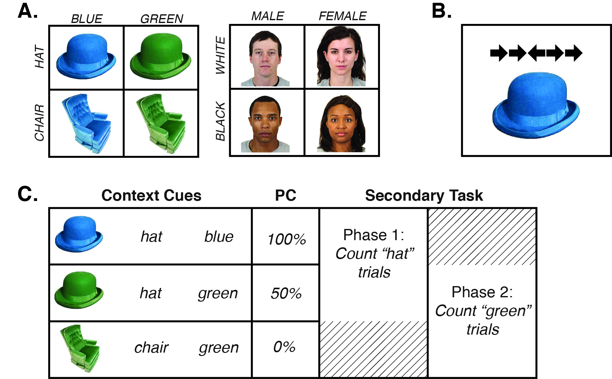

```{r setup, include=FALSE, eval=TRUE,echo=FALSE}
#As of 2018/12/07 apa_print() requires development version of Papaja
#devtools::install_github("crsh/papaja")
library(papaja)

source("data-analysis/analysis_E1.R")
source("data-analysis/analysis_E2.R")
source("data-analysis/analysis_E3.R")
source("data-analysis/table1.R")
source("data-analysis/table2.R")
source("data-analysis/table3.R")
source("data-analysis/analysis_E1_Exploratory.R")
source("data-analysis/plot-power-simulation.R")
```

Selective attention is commonly investigated using interference paradigms like the Stroop [-@stroop_studies_1935] and flanker [@eriksen_effects_1974] tasks, where participants identify a target while ignoring a response-congruent or -incongruent distractor. Performance is typically better on congruent versus incongruent trials and the difference---the congruency effect---taken as an index of attentional priorities. Large congruency effects are thought to reflect ineffective filtering of the distracting stimuli whereas small congruency effects are thought to reflect effective filtering. By probing factors that systematically alter congruency effects, we can then make inferences about processes that control attentional filtering. For example, manipulating the frequency of conflict via the proportion of congruent versus incongruent trials has shown to influence the size of the congruency effect. Typically, a high proportion congruent experiment produces large congruency effects, whereas a low proportion congruent experiment produces small congruency effects [@logan_when_1979; @lowe_selective_1982; @west_effects_1998]. This result is usually  explained as strategic control, where participants increase attentional control under high conflict demands and relax attentional control under low conflict demands [@logan_attention_1980; @logan_strategies_1984; @logan_when_1979; @lowe_selective_1982]. Recent work however, has demonstrated that attentional control is not only adjusted by top-down regulation, but can also be triggered automatically by environmental cues [@brosowsky_memory-guided_2018; @bugg_support_2012; @egner_creatures_2014; @fischer_predicting_2015; @king_priming_2012; @mayr_outsourcing_2007]. 

For example, Crump, Gong, and Milliken [@crump_context-specific_2006; see also, @corballis_independent_2003] presented Stroop stimuli in one of two randomly chosen locations and manipulated the frequency of conflict associated with each location. One location was associated with a high frequency of conflict (25% congruent trials) and the other with a low frequency of conflict (75% congruent trials). Overall, the proportion of congruent trials was 50% and trials were randomized such that the upcoming location could not be predicted. Even so, congruency effects were shown to be smaller for trials where the stimulus appeared in the high conflict location as compared to the low conflict location. This effect, known now as the context-specific proportion congruent effect (CSPC), has now been replicated in a number of different selective attention paradigms [e.g., @alards-tomalin_auditory_2017; @blais_trial-by-trial_2015; @bugg_conflict-triggered_2014; @crump_context-dependent_2018; @crump_learning_2016; @fischer_context-sensitive_2014; @hubner_location-specific_2016].

Critical evidence however, that CSPC effects reflect context-specific control rather than other non-control learning processes [e.g., @schmidt_stroop_2008], comes from work showing that CSPC effects can transfer to frequency unbiased items [@brosowsky_context-specific_2016; @crump_flexibility_2009; @weidler_attentional_2018; @weidler_transfer_2016; though, see @hutcheon_limits_2017]. Crump and Milliken (2009), for example, divided Stroop items into two mutually exclusive sets (e.g., RED/GREEN and BLUE/YELLOW). One set was defined as the frequency biased set, and presented with 75% congruency in one location, and 25% congruency in the other. The second set however, was presented with 50% congruency in both locations. Nevertheless, they found smaller congruency effects for unbiased items presented in the high conflict location as compared to the low conflict location.	

One explanation for CSPC effects is that the repeated application of attentional priorities in a particular context creates an associative link in episodic memory between the attentional control procedures and the contextual information [@abrahamse_grounding_2016; @brosowsky_memory-guided_2018; @crump_learning_2016; @egner_creatures_2014]. Once the associative link is established, processing the context is assumed to trigger the retrieval of previous experiences, automatically reinstating associated attentional priorities. As a result, automatic memory-based retrieval allows attentional priorities to be rapidly adjusted in a context-appropriate fashion. How the learning and reinstatement process works however, remains  largely unclear. 

The current study addresses two related issues: First, how is attentional control resolved when multiple contextual features could be used as cues? And second, what determines the expression and/or suppression of previously learned attentional associations?

Real-world environments are complex and contain many potential cues for directing attention. For instance, a coffee shop is a rich environment with numerous context cues (e.g., pictures on the wall, chairs, coffee, laptop), each of which someone could have different experiences with and afford different learned associations. A laptop for example, could cue attentional processing helpful for writing while other features of the coffee shop might cue attentional processing related to other experiences like socializing and people-watching. Given that all of these cues are available to set attentional priorities, what determines which associative relationships will be used to guide attention? On the one hand, context-based retrieval of attentional priorities might be completely obligatory: the mere presence of learned cues might trigger attention in a ballistic manner [e.g., @schneider_controlled_1977; @shiffrin_controlled_1977]. Attention in this case would be at the mercy of the environment and attention is guided by the strongest association. On the other hand, our current task-goals might constrain the expression of previously learned associations. If someone sits down to write in the coffee shop, their current goals may allow the laptop to take priority over other environmental cues that are irrelevant to the task at hand. 

Historically, perspectives of automaticity and attentional control have emphasized the role of practice and likened the learning of attentional associations to the development of automaticity in skill-learning [@schneider_controlled_1977; @shiffrin_controlled_1977; @logan_toward_1988; @logan_attention_1992]. Under this view, forming an association requires many repeated experiences pairing a cue with a set of attentional priorities. Once formed however, it becomes habitual or hard-wired and the mere presence of the cue is sufficient to automatically adjust attention. Learned associations are therefore ballistic, difficult to suppress, and difficult to unlearn [e.g., @schneider_controlled_1977; @shiffrin_controlled_1977; @posner_attention_1975; @posner_facilitation_1975; @treisman_contextual_1960; @treisman_selective_1964; @treisman_strategies_1969]. This view is often referenced in modern work on contextual cuing where it is assumed that learned associations require practice [e.g., @lehle_fly_2008; @crump_learning_2016], form without awareness or intention, and are triggered automatically by the mere presence of the cue [@crump_context-specific_2006; @crump_contextual_2010; @crump_context-specific_2008; @king_priming_2012; @reuss_unconscious_2014; though, see @brosowsky_context-specific_2016].

An alternative view---the memory-based perspective---takes a more nuanced view [@norman_memory_1969; @norman_memory_1976; @abrahamse_grounding_2016; @brosowsky_memory-guided_2018; @crump_learning_2016; @egner_creatures_2014]. Here, practice is only important to the extent that it improves memory encoding and retrieval. Learning an association can be thought of as the process of encoding experiences where attentional priorities and cues co-occur. The expression of previously learned associations however, is dictated by memory retrieval---a similarity-based, cue-driven process [e.g., @jacoby_interpreting_1978; @hintzman_minerva_1984; @hintzman_schema_1986; @hintzman_judgments_1988]. Presumably, the features of our immediate environment automatically cue memory and reinstate the retrieved attentional priorities [@logan_toward_1988; @logan_attention_1992]. If a few prior experiences are easily retrievable (i.e., memories are distinct or very similar to the retrieval cue), they could support the reinstatement of a learned attentional association despite very little practice [e.g., @brosowsky_memory-guided_2018]. Conversely, if prior experiences are difficult to retrieve (i.e., memories are indistinct or low in similarity to the retrieval cue), then learned associations may not be expressed, even after much practice. To the extent that you could manipulate memory retrieval, you should also be able manipulate the expression of learned associations. 

Here, we examine whether task-relevance influences the retrieval of previously used attentional priorities. We hypothesized that the cue-driven, memory-retrieval process might be constrained to the features of our environment that are relevant to our on-going task and goals. If this is the case, then a previously learned association should be easily suppressed if that feature was made irrelevant to the task because that feature would no longer contribute to memory-retrieval. Furthermore, it would suggest that the mere presence of a cue is not sufficient for automatically directing attention, but instead requires task-integration (for a similar perspective, see @hommel_event_2004; @hommel_theory_2019). 

Recent work on contextual cueing suggests that task-relevance is important for establishing new context-attention associations. Crump, Vaquero, & Milliken [-@crump_context-specific_2008] used a Stroop prime-probe task where the distractor word is presented first followed by a color patch probe. Critically, they used the shape of the color patch probe, either a square or a circle, as the contextual dimension; one associated with a high frequency of conflict, the other with a low frequency. In one experiment participants were made aware of the shape-proportion contingencies but given no additional instructions. In the second, participants were given a secondary task to count the number of trials that contained a square. The first experiment failed to find evidence for context-specificity, whereas the second did. Although not testing task-relevance directly, @canadas_social_2013 found similar effects. In this study they used images of male and female faces as context cues in a flanker task. When given instructions to think of the faces as members of the gender categories they found CSPC effects, but when given instructions to think of the faces as individuals they did not. These results suggest that making a context dimension relevant to the on-going task is important for establishing new associations and producing CSPC effects. However, the extent to which task-relevance influences the expression of previously learned associations is still unknown. 

<!-- Furthermore, most commonly used context cue is location [@brosowsky_context-specific_2016; @corballis_independent_2003; @crump_context-specific_2006; @crump_context-specific_2008; @crump_learning_2016; @weidler_attentional_2018; @weidler_transfer_2016], often claimed to be irrelevant to the on-going conflict task. Although in some sense, the location is irrelevant for identifying the color of a word in a Stroop task, it seems disingenuous to consider it completely task-irrelevant. In order to identify the target, the participant must first identify and orient to its location on the screen. In this is sense, it is relevant to their ability to complete the task. Further, there is some evidence that location information may receive priority during encoding [@logan_what_1998; @mayr_spatial_1996]. Similar arguments could be made about other context features that are inherent to processing the target stimulus, like font-type [@bugg_multiple_2008] and color [@vietze_context_2009].  -->


# Experiment 1

```{r figure1, echo=FALSE, fig.width=6.7,fig.height=4.51, fig.cap='(ref:figure1)'}
#, out.width="\\textwidth", fig.env="figure*"

```

(ref:figure1) Illustration of the stimuli and trial construction. Figure 1A shows the feature dimensions for each of the conditions. Figure 1B shows an example trial stimulus containing both the context and flanker images. Figure 1C shows an example of how feature dimensions could have been assigned to each proportion congruency (PC) condition, and an example of the secondary task assignments. The secondary task order, as well as the feature and congruency assignments were all randomized for each participant.


Prior work suggests that the task-relevance of contextual information could be important for establishing new associations between context cues and attentional priorities. Simply put, CSPC effects tend to emerge when context cues are somehow made relevant to the task, but do not when made irrelevant [@canadas_social_2013; @crump_context-specific_2006; @crump_context-specific_2008]. However, what determines the  expression of previously learned context-attention associations remains unclear. In the current study, we examined whether manipulating task-relevance would allow participants to suppress a previously learned association and adopt a new context-specific control strategy.

A flanker task was used to measure attentional control in an adapted CSPC design [@crump_flexibility_2009; @crump_reproducing_2017]. Similar to previous studies, flanker stimuli were presented in contexts associated with differing levels of conflict (0%, 50%, or 100% congruent). However, unlike previous CSPC designs where contexts were defined by a single discriminating feature (e.g., upper vs. lower screen locations), contexts were defined by two feature dimensions (see Figure 1A). In one condition, for example, contexts were defined by object identity (hat or chair) and color (blue or green). Only three out of the four possible feature combinations were presented, each associated with a different proportion of congruent trials (0%, 50%, or 100% congruent). Critically, the frequency unbiased context (50% congruent) always shared a feature with each of the frequency-biased contexts (0% and 100% congruent). The frequency biased contexts (0% and 100% congruent) however, did not share any features (see Figure 1C for an example).

A secondary counting task was used to manipulate the task-relevance of the context dimensions [@crump_flexibility_2009] which critically, switched halfway through the experiment. Participants were instructed to keep a running count of one of the overlapping features (e.g., "count whenever a hat is presented") which was associated with either a high or low frequency of conflict. Halfway through the experiment they received new instructions to count the other overlapping feature (e.g., "count whenever a green item is presented"). Critically, the set of context images remained the same throughout the experiment (see Figure 1C for an example) and the task-relevance of the context dimensions was the only aspect of the experiment that changed from the first to second phases.

The critical measure of interest is the congruency effect produced in the frequency unbiased context. If, on the one hand, task-relevance has no impact on the use of context-attention associations we would expect no differences between the congruency effects when the high conflict context dimension is made task-relevant or the low conflict context dimension is made task-relevant. This could occur because all three contexts are treated as individual contexts throughout the whole experiment [e.g., @canadas_social_2013]. Or it could occur because associations formed in the first block interfere with learning new associations in the second [e.g., @brosowsky_context-specific_2016]. On other hand, task-relevance may dictate the expression of previously learned associations. In this case, we would expect smaller congruency effects when the high conflict context dimension is made task-relevant as compared to when the low conflict context dimension is made task-relevant. This would demonstrate that participants were able to suppress a previously learned association and adopt a new context-specific control strategy.

A secondary goal was to conceptually replicate previous findings and test the generalizability of any task-relevance effects. Therefore, we included three conditions that differed only in the kinds of stimuli used to create context cues. In one condition we used face images where context dimensions were defined by social categories, similar to @canadas_social_2013. However, they found that social categorization occurred spontaneously and it was unclear what impact that would have on the current results. Therefore, we included another condition that used images of simple objects where context dimensions were defined by object features. Finally, @canadas_social_2013 also found that context effects generalized to novel face images. In our third condition we used non-repeating face exemplars to examine whether any task-relevance effects would also generalize in our design or if learning would be image-specific. 

# Methods

## Participants
All participants were recruited from Amazon Mechanical Turk (AMT) and compensated \$2.00 for participating. The amount compensated was calculated by estimating the maximum amount of time required to complete each experiment and multiplying by \$6.00 per hour. For each experiment the number of HITs (Human intelligence tasks, an Amazon term for a work-unit) refers to the number of participants who initiated the study. Participants were included in the study if they completed all trials. We posted 150 HITs and 144 participants completed all trials. 
 
## Apparatus & Stimuli

The experiments were programmed using JavaScript, CSS and HTML. The program allowed participants to complete task only if they were running Safari, Google Chrome, or Firefox web browsers. Flanker stimuli consisted of images of five arrows pointed left or right presented at 250 x 50 pixels (each arrow was 50 x 50 pixels). Context stimuli were constructed using images selected from @brady_visual_2013 color-rotated to blue and green, and face images from the Chicago Face Database [@ma_chicago_2015], supplemented with the NimStim Set of Facial Expressions [@tottenham_nimstim_2009]. The object images were displayed at 250 x 250 pixels, while the face images were displayed at 250 x 313 pixels. The experiment ran as a pop-up window that filled the entire screen. The background was white, and stimuli were presented in the center of the screen.

## Design 
Experiment 1 used a 2x2x3 mixed design with task-relevant context (high conflict and low conflict) and unbiased-item congruency (congruent and incongruent) as within-subject factors, and context-type (object, social, and social/non-repeating) as the between-subjects factor.

All three conditions were constructed using the same general method. The experiment was divided into two phases. Each phase consisted of 144 flanker trials (48 trials per context), and 13 count response trials for a total of 314 trials. On the count response trials, participants indicated how many trials they had counted until that point. The count response trials occurred once for every 12 flanker trials and was randomly inserted between trial 6 and 12 of each 12-trial block. Each phase ended with one additional count response trial. 

On every flanker trial, participants were presented with flanker stimuli paired with one of three contexts. Each context was associated with a different proportion congruency such that two cues were associated with a biased frequency (0% and 100% proportion congruency), while one was associated with an unbiased frequency (50% proportion congruency). The feature dimensions and corresponding context images assigned to each of the biased and unbiased item sets were randomly determined for each participant. However, context images used for the frequency biased trials never shared features, while the frequency unbiased context image always shared a feature with each of the frequency biased context images (see Figure 1). Additionally, the feature assignments remained the same throughout phases 1 and 2, and critically, the only change to the task was which feature the participant was instructed to count (see Figure 1C for an example).

All critical aspects of the task were randomized between participants. This includes the three chosen context images, the features assigned to proportion levels, the features assigned to each counting condition, the secondary task order, and the order of trials.

## Procedure
All participants were AMT workers who found the experiment using the AMT system. The participant recruitment procedure and tasks were approved by the Brooklyn College Institutional Review Board. Each participant read a short description of the task and gave consent by pressing a button acknowledging they had read the displayed consent form. Participants then completed a short demographic survey, and proceeded to the main task, which was displayed as a pop-up window. Participants were instructed to identify the direction of the center arrow on each trial as quickly and accurately as possible by pressing 'z' if the arrow pointed left, and 'm' if the arrow pointed right. Additionally, they were instructed to silently keep count of the number of trials that contained a feature. In the object context condition, they were asked to count trials that contained a certain color (blue or green) or object-identity (hat or chair) and in the social context conditions they were asked to count the number of trials that contained appeared a certain gender (male or female) or race (black or white). Periodically throughout the experiment, participants were asked to report how many trials they had counted until that point and to restart their count from 0. Halfway through the experiment participants received new instructions about which feature to count (see Figure 1C).

Each trial began with a blank inter-stimulus interval (ISI) of 400 ms, followed by a fixation cross presented in the center of the screen for 200 ms, then a second blank ISI of 400 ms. Next, the flanker and context stimuli appeared in the center of screen (the flanker above the context image; see Figure 1B) and remained on screen until a response was made. Following a response, accuracy feedback was presented for 1000 ms. A response automatically triggered the next trial. 

Halfway through the experiment (157 trials), participants received new instructions about which feature to count and to press the button on-screen when they were ready to continue.

```{r figure2, echo=FALSE,fig.width=6.875, fig.height= 4, fig.cap='(ref:figure2)'}
#, out.width="\\textwidth", fig.env="figure*"
#print figure 2
#source: data-analysis/analysis.R
figure2
```

(ref:figure2) Results from Experiment 1 showing congruency effects (incongruent - congruent) for frequency unbiased items in reaction times (left) and error rates (right) as a function of the task-relevant context (100% proportion congruent versus 0% proportion congruent). Task-relevance was manipulated by the secondary feature-counting task.

## Data Analysis 

All analyses in this and the following experiments were performed in R [@r_software_2019] using a variety of R packages and resources [@r_wickham_ggplot2_2016; @r_wickham_dplyr_2019; @r_papaja_2018; @r_cowplot_2019]. Of particular note: we used the afex and car packages to perform all the Null Hypothesis Significance Tests [@r_afex_2019; @r_car_2019], the BayesFactor package to perform Bayesian analyses [@r_bayesfactor_2018], and the conflictPower package to perform the simulation-based sensitivity and power analyses [@r_conflictPower_2019]. All data and scripts can be found on the Open Science Framework (https://osf.io/ztcyb/).

We supplemented each Null Hypothesis Significance Test with a Bayes Factor analysis [@rouder_bayesian_2009]. Using conventional frequentist testing it is not possible to quantify the evidence for a null effect. A Bayes Factor, however, is a continuous measure of the relative strength of evidence and can quantify the degree to which the data are compatible with the null over the alternative hypothesis [@dienes_using_2014; @rouder_bayesian_2009]. All Bayesian analyses were performed using the R package BayesFactor and Bayes Factors ($\mathrm{BFs}$) were calculated using its default settings [@r_bayesfactor_2018]. $\mathrm{BF}_{\textrm{10}}$ indicates evidence in favor of the alternative hypothesis whereas $\mathrm{BF}_{\textrm{01}}$ indicates evidence in favor of the null hypothesis. To simplify the interpretation, we report the Bayes Factor in the direction the data supports (e.g.,  $\mathrm{BF}_{\textrm{01}}$ when there is more evidence in favor of the null over alternative hypothesis). As per previous recommendations, we refer to a $\mathrm{BF > 3}$ as "moderate" and $\mathrm{BF > 10}$ as "strong" evidence [@jeffreys1961theory; @rouder_bayesian_2009].

# Results

Participants with mean error rates greater than 25% were excluded from the analyses, eliminating `r N_subjects_removed` participants. For all remaining participants, the correct RTs from frequency unbiased trials in each condition were submitted to an outlier removal procedure. The non-recursive Van Selst and Jolicoeur outlier removal procedure was applied after removing response times greater than 3000 ms [@van_selst_solution_1994]. This procedure removed `r round(percent_removed*100,digits = 2)`% of the total observations. 

The primary question of interest was whether the task-relevance of context features associated with different levels of conflict would influence the size of the congruency effect for frequency unbiased items (see Table 1). To that end, congruency effects (incongruent minus congruent performance) from frequency unbiased trials were submitted to a mixed analysis of variance (ANOVA) with task-relevant context (0\% and 100\% PC) as the within-subjects factor and context-type (object, social, and social/non-repeating) as the between-subjects factor. We supplement each Null Hypothesis Significance Test with a corresponding Bayesian analysis. 

The results of the reaction time analysis revealed a significant effect of the task-relevant context, `r RT_ANOVA$Task_Relevant_Context`, with moderate evidence in favor of the alternative, `r pRT_BF[[2]]`. Specifically, we found smaller congruency effects when the context dimension associated with high conflict was made task-relevant as compared to when the low conflict dimension was made task-relevant. The main effect of context-type, however, was non-significant, `r RT_ANOVA$Condition`, with moderate evidence in favor of the null hypothesis, `r pRT_BF[[1]]`. The two-way interaction between the task-relevant context and context-type was also non-significant, `r RT_ANOVA$Condition_Task_Relevant_Context`, with moderate evidence in favor of the null hypothesis, `r pRT_BF[[4]]`. Finally, the preferred model containing only the task-relevant context was preferred over the model containing the both factors and the interaction by a factor of `r BF_contrast`. Therefore, congruency effects did not vary across context-types and, more importantly, the effect of task-relevance did not vary across context-types.

Similarly, the corresponding error analysis also resulted a significant effect of the task-relevant context, `r ACC_ANOVA$Task_Relevant_Context`, with moderate evidence in favor of the alternative evidence `r pACC_BF[[2]]`; A non-significant effect of context-type, `r ACC_ANOVA$Condition`, with moderate evidence for the null hypothesis, `r pACC_BF[[1]]`; And a non-significant interaction between task-relevant context and context-type,`r ACC_ANOVA$Condition_Task_Relevant_Context`, with strong evidence in favor of the null hypothesis,`r pACC_BF[[4]]`. Therefore, the congruency effects in error rates were also smaller when the context dimension associated with high conflict was made task-relevant and effects did not vary across context-type, corroborating the results of the reaction time analysis. 


```{r echo=FALSE, results='asis'}
#, fig.align="center", fig.cap="" ,out.width="\\textwidth", fig.env="figure*"
cat(TR_Table)
 
#knitr::include_graphics("images/table1.pdf")
```


## Exploratory analyses: Order effects

```{r figure2b, echo=FALSE,fig.width=6.875, fig.height= 4, fig.cap='(ref:figure2b)'}
#, out.width="\\textwidth", fig.env="figure*"
#print figure 2
#source: data-analysis/analysis.R
#figure2B
```


Previous work has shown that shifting between list-wide proportion congruent phases produced asymmetrical effects. @abrahamse_attention_2013 found that shifting from a mostly-congruent to mostly-incongruent list produced a large change in the size of the congruency effect, whereas shifting from a mostly-incongruent to mostly-congruent list produced a relatively small change in congruency effects. The authors posited a learned attentional modulation in the mostly-incongruent block had carried over into the mostly-congruent block reducing what, typically, would be a large congruency effect. In our study, we were primarily interested in whether (a) participants could use context cues despite the presence of competing, contradictory cues, and (b) whether participants could switch from the use of one context cue to another. We therefore randomized the order across participants to control for the effects of order. However, given that we did find systematic shifts in the CSPC effect for unbiased items, we can also ask whether the shift between phases was asymmetrical. 

To address this question, we collapsed over context-type and categorized participants according to the order of the counting task: 100% congruent to 0% congruent (100%-0%) or 0% congruent to 100% congruent (0%-100%). We again removed participants with error rates greater than 25% and adopted the same outlier removal procedure as described above. We submitted congruency effects for frequency unbiased items to a 2x2 mixed ANOVA with task-relevant context (0% and 100% PC) as within-subject factors and phase order (100%-0% and 0%-100%) as the between-subjects factor, and supplemented each test with a corresponding Bayesian analysis. 

Consistent with the original analysis, the effect of task-relevant context was significant,`r E1_Order_A$Task_Relevant_Context`, with moderate evidence in favor of the alternative, `r pE1_Order_A_BF[[2]]`. However, the two-way interaction between task-relevant context and phase order was non-significant, `r E1_Order_A$Order_Task_Relevant_Context`, with moderate evidence in favor of the null hypothesis, `r pE1_Order_A_BF[[4]]`. Therefore, we did not find statistical support for a list-shift asymmetry. Additionally, the (non-significant) asymmetrical effects we do see in this sample is in the opposite direction than would be predicted given the prior research [e.g., @abrahamse_attention_2013].

We also conducted an additional, more severe, test of the list-shift hypothesis. Given that the asymmetry is interpreted as resulting from a carry-over of learned attentional modulation across phases, we might expect that any asymmetry would be exaggerated near the point of transition. We therefore repeated the above analysis but restricted it to the 24 trials immediately before the transition and 24 trials immediately after the transition. 

Again, the interaction between task-relevant context and phase order was non-significant, `r E1_Order_B$Order_Task_Relevant_Context`, with moderate to strong evidence in favor of the null `r pE1_Order_B_BF[[4]]`. Interestingly, the main effect of task-relevant context was still significant, `r E1_Order_B$Task_Relevant_Context`, with moderate evidence in favor of the alternative, `r pE1_Order_B_BF[[2]]`. This result supports the conclusion that there was no asymmetry. Additionally, the the shift in context-dependent effects appears to have taken place almost immediately after the transition.


# Experiment 2

In Experiment 1, we found that manipulating the task-relevance of a shared contextual feature was associated in predictable changes in context-specific proportion congruency effects for frequency unbiased context items. Namely, we found larger congruency effects when the context was associated with low conflict than when the context was associated with high conflict. This suggests that participants learned the association between context and conflict-level in the first block (despite multiple context cues), and subsequently suppressed in the second block, allowing participants to learn a new association. Task-relevance then, may not just be important for establishing new associations [e.g.,@crump_flexibility_2009] but also important for determining which learned associations are expressed in the present moment.

We made two assumptions in the design of Experiment 1: First, we assumed that task-relevance was required for participants to learn about the associations between context cues and the biased proportion congruency manipulations. Our task was inspired by @crump_flexibility_2009 who failed find context-specific effects using a task-irrelevant shape cue until they used a counting task to make the shapes relevant. However, location is the most-often used context cue in these kinds of paradigms (e.g., ). In these cases, no task-relevance manipulation is necessary to produce CSPC effects, though, it is arguable whether location is truly task-irrelevant when localizing the target is necessary for responding. Regardless, it is unclear in our paradigm whether participants required the counting task to learn about the biased proportion congruency manipulations.

Second, we assumed that the biased proportion congruency manipulations would have no systematic effect on the unbiased items without the counting task. Although we randomized all aspects of the task across participants to control for potential confounds, it still remains unclear whether the biased items would influence how participants responded to the unbiased items.

Experiment 2, therefore, serves as a control experiment to test these two assumptions directly. Experiment 2 is identical to Experiment 1 with two important changes: First, we removed the counting task, giving no explicit instructions about how to use the context cues. We only informed participants that images would be present throughout the task. This allowed us to determine if there was any systematic effect of biased items on the unbiased items absent the counting task. Second, we altered the proportion congruency of the biased item sets from 100%/0% to 75%/25%. This allowed us to measure the congruency effect for the biased item sets to determine whether participants learned about the associations between proportion congruency and the context cues without the counting task [e.g., @crump_flexibility_2009]. If this were the case, we would expect larger congruency effects for the 75% proportion congruent items as compared to the 25% proportion congruent items.

# Methods

## Participants
All participants were recruited from Amazon Mechanical Turk (AMT) and compensated \$2.00 for participating. The amount compensated was calculated by estimating the maximum amount of time required to complete each experiment and multiplying by \$6.00 per hour. For each experiment the number of HITs (Human intelligence tasks, an Amazon term for a work-unit) refers to the number of participants who initiated the study. Participants were included in the study if they completed all trials. We posted 50 HITs and 50 participants completed all trials. 
 
## Apparatus & Stimuli

The apparatus and stimuli were identical to Experiment 1. The context stimuli were identical to those used for the object condition in Experiment 1.

## Design 
Experiment 2 used a 2x3 within-subjects design with proportion congruent (25%, 50%, and 75%) and  congruency (congruent and incongruent) as factors. The experiment consisted of 288 flanker trials (96 per proportion congruent condition) and did not include any counting trials or instructions informing participants about the proportion manipulations. The design in every other respect was identical to Experiment 1.

## Procedure
All participants were AMT workers who found the experiment using the AMT system. The participant recruitment procedure and tasks were approved by the Brooklyn College Institutional Review Board. Each participant read a short description of the task and gave consent by pressing a button acknowledging they had read the displayed consent form. Participants then completed a short demographic survey, and proceeded to the main task, which was displayed as a pop-up window. Participants were instructed to identify the direction of the center arrow on each trial as quickly and accurately as possible by pressing 'z' if the arrow pointed left, and 'm' if the arrow pointed right. 

Each trial began with a blank inter-stimulus interval (ISI) of 400 ms, followed by a fixation cross presented in the center of the screen for 200 ms, then a second blank ISI of 400 ms. Next, the flanker and context stimuli appeared in the center of screen (the flanker above the context image; see Figure 1B) and remained on screen until a response was made. Following a response, accuracy feedback was presented for 1000 ms. A response automatically triggered the next trial. 

```{r figure3, echo=FALSE, fig.width=3.25, fig.height=4, fig.cap='(ref:figure3)'}
#print figure 3
#source: data-analysis/analysis_E2.R
figure3
```

(ref:figure3) Results from Experiment 2 showing congruency effects (incongruent - congruent) across proportion congruency (25%, 75%, and 100% PC) in reaction times (left) and error rates (right).


# Results
Participants with mean error rates greater than 25% were excluded from the analyses, eliminating `r N_subjects_removed_E2` participants. For all remaining participants, the correct RTs from frequency unbiased trials in each condition were submitted to an outlier removal procedure. The non-recursive Van Selst and Jolicoeur outlier removal procedure was applied after removing response times greater than 3000 ms [@van_selst_solution_1994]. This procedure removed `r round(percent_removed_E2*100,digits = 2)`% of the total observations.

The questions of interest were whether participants would learn the associations between the context cues without the task-relevance manipulation (i.e., the counting task) and whether responding to the unbiased cues would be influenced by the presence of the biased cues. To that end, congruency effects (incongruent minus congruent performance) for RTs and error rates were submitted to an analysis of variance (ANOVA) with proportion congruency (25%, 50%, and 75%) as the sole within-subject factor.

The results of the RT analysis revealed the effect of proportion congruency to be non-significant, `r RT_ANOVA_E2$PC`, with moderate evidence in favor of the null, `r RT_BF_E2[[1]]`. Similarly, the corresponding error analysis also resulted in a non-significant effect of proportion congruency, `r ACC_ANOVA_E2$PC`, with strong evidence in favor of the null, `r ACC_BF_E2[[1]]`. Therefore, there was no evidence that the context cues, absent the counting task, systematically influenced the congruency effects in any way.


```{r echo=FALSE, results='asis'}
#, fig.align="center", fig.cap="" ,out.width="\\textwidth", fig.env="figure*"
cat(TR_Table_2)
 
#knitr::include_graphics("images/table1.pdf")
```

# Experiment 3

The goal of the current study has been to examine the importance of task-relevance for the contextual recruitment of selective attention. In Experiment 1, we found that task-relevance allowed participants to exploit context cues in the presence of a competing, contradictory cue and subsequently suppress a previously learned association in favor of a different context cue. In Experiment 2, we conceptually replicated previous work showing that task-relevance was necessary for participants to learn about the biased proportion congruency associations [e.g., @crump_flexibility_2009] and ruled out possible confounding effects of the biased items.

Experiment 3 tests the boundaries of the task-relevance effect found in Experiment 1. The evidence thus far suggests that context-cues, rather than being irrelevant to the task (as their namesake would suggest), need to be integrated into the task-representation to guide attentional control. There is some evidence that instructions alone can be sufficient to produce list-wide proportion congruency effects, though not item-specific proportion congruency effects [@entel_proportion_2014; @desender_different_2018] and not context-specific proportion congruency effects [@crump_flexibility_2009]. Explicit instructions however, are another way of making context-cues relevant to the on-going task and could serve the same purpose as the counting task. In Experiment 3, we test whether participants are able to explicitly use the context-cues to guide attentional control through an instruction manipulation. 

# Methods

## Participants
All participants were recruited from Amazon Mechanical Turk (AMT) and compensated \$2.00 for participating. The amount compensated was calculated by estimating the maximum amount of time required to complete each experiment and multiplying by \$6.00 per hour. For each experiment the number of HITs (Human intelligence tasks, an Amazon term for a work-unit) refers to the number of participants who initiated the study. Participants were included in the study if they completed all trials. We posted 50 HITs and 50 participants completed all trials. 
 
## Apparatus & Stimuli

The apparatus and stimuli were identical to Experiment 1. The context stimuli were identical to those used for the object condition in Experiment 1.

## Design 
Experiment 3 used a 2x3 mixed design with task-relevant context (0% and 100%) and unbiased-item congruency (congruent and incongruent) as the within-subject factors. The experiment consisted of 288 flanker trials (96 per proportion congruent condition) and did not include any counting trials. However, participants were explicitly informed about the proportion congruency manipulations and instructed to make used of the context cues (see the Procedure section below for more details). Therefore, unlike Experiment 1, context images were made task-relevant through explicit instructions rather than the counting task. The design in every other respect was identical to Experiment 1.

## Procedure
All participants were AMT workers who found the experiment using the AMT system. The participant recruitment procedure and tasks were approved by the Brooklyn College Institutional Review Board. Each participant read a short description of the task and gave consent by pressing a button acknowledging they had read the displayed consent form. Participants then completed a short demographic survey, and proceeded to the main task, which was displayed as a pop-up window. Participants were instructed to identify the direction of the center arrow on each trial as quickly and accurately as possible by pressing 'z' if the arrow pointed left, and 'm' if the arrow pointed right. 

Importantly, participants were given further instructions to exploit the proportion congruency associated with context cues. Halfway through the experiment, participants received new instructions about which context features were relevant and associated with high/low conflict. For example:

> *"On every trial you'll see five arrows (pointed left or right) paired with an image.*  
    
> *The images will help you perform this task.*   
    
> *The arrows will either be congruent (the center arrow is the same as the flanking arrows) or incongruent (the center arrow is different from the flanking arrows). Incongruent trials are typically harder because you need to ignore the flanking arrows, while the congruent trials are easier, because you do not need to ignore the flanking arrows.*   
    
> *In the first block of the experiment, trials that include a chair (regardless of whether it is blue or green) will be mostly incongruent. That is, most of the trials that include a chair will be hard.* 
    
> *This will be helpful to perform the task, so try to proactively use this information when you perform the task."*   
    
Each trial began with a blank inter-stimulus interval (ISI) of 400 ms, followed by a fixation cross presented in the center of the screen for 200 ms, then a second blank ISI of 400 ms. Next, the flanker and context stimuli appeared in the center of screen (the flanker above the context image; see Figure 1B) and remained on screen until a response was made. Following a response, accuracy feedback was presented for 1000 ms. A response automatically triggered the next trial. 


```{r figure4, echo=FALSE, fig.cap='(ref:figure4)', fig.width=3.25, fig.height=3.5}
#print figure 3
#source: data-analysis/analysis_E2.R
figure4
```

(ref:figure4) Results from Experiment 3 showing congruency effects (incongruent - congruent) for frequency unbiased items in reaction times (left) and error rates (right) as a function of the task-relevant context (100% proportion congruent versus 0% proportion congruent). Task-relevance was manipulated through explicit instructions.


# Results
Participants with mean error rates greater than 25% were excluded from the analyses, eliminating `r N_subjects_removed_E3` participants. For all remaining participants, the correct RTs from frequency unbiased trials in each condition were submitted to an outlier removal procedure. The non-recursive Van Selst and Jolicoeur outlier removal procedure was applied after removing response times greater than 3000 ms [@van_selst_solution_1994]. This procedure removed `r round(percent_removed_E3*100,digits = 2)`% of the total observations.

The primary question of interest was whether the task-relevance of context features (made relevant through explicit task instructions) associated with different levels of conflict would influence the size of the congruency effect for frequency unbiased items. Mean correct RTs and mean error rates from frequency unbiased trials were submitted to an analysis of variance (ANOVA) with task-relevant context (0% and 100% PC) as the within-subject factors.

The results of the RT analysis revealed the effect of task-relevance to be non-significant, `r RT_ANOVA_E3$Task_Relevant_Context`, with moderate evidence in favor of the null, `r RT_BF_E3[[1]]`. Similarly, the corresponding error analysis also resulted in a non-significant effect of task-relevance, `r ACC_ANOVA_E3$Task_Relevant_Context`, with moderate evidence in favor of the null, `r ACC_BF_E3[[1]]`.


```{r echo=FALSE, results='asis'}
#, fig.align="center", fig.cap="" ,out.width="\\textwidth", fig.env="figure*"
cat(TR_Table_3)
 
#knitr::include_graphics("images/table1.pdf")
```


# Estimating replicability by simulation-based sensitivity- and power-analyses

In Experiment 1, we found no evidence for differences in the task-relevance effect across context-type. Similarly, Experiments 2 and 3 failed to find CSPC effects. To determine the limitations in our ability to draw inferences from these results, we need to assess the extent to which our experiments could have detected effects, if present. Although replicability has become an important and salient issue in Psychology at large [e.g., @camerer_evaluating_2018; @open_science_collaboration_estimating_2015], this issue has also arisen in the context-specific proportion congruency literature [@crump_reproducing_2017; @hutcheon_limits_2017; ].

To address this issue in the current study---and to do so transparently---we conducted simulation-based power and sensitivity analyses [] to determine the range effect sizes our experimental design was sensitive to detect and the required sample sizes to detect a range of effects. We used a Monte Carlo simulation approach with a statistical model of the distributions that underlie the effect of interest (Maxwell, 2008). Rather than estimating power based on observed effect sizes from prior experiments (typically, over-estimates), we instead estimated the properties of the base reaction time distributions from our current data and sampled from these distributions using a Monte Carlo simulation approach to estimate the replication success rate across a range of effect sizes and sample sizes. 

We created the conflictPower R-package to conduct the Monte Carlo simulations [@r_conflictpower_2019]. The conflictPower package samples simulated reaction time data for subjects at the trial-level using base reaction time distributions for the conflict and no-conflict conditions. To generate the base reaction time distributions, we fitted ex-Gaussian functions to the reaction time data from individual participants and averaged across all three experiments using the retimes R-package [@r_retimes_2013]. We then used the conflictPower package to simulate the results across a range of effect and sample sizes, calculating the proportion of experiments, across $10 000$ simulations, resulting in a p-value less than $.05$ (see Figure 5; for a more detailed explanation of the sampling procedure see Crump and Brosowsky, 2019). 

First, the results of these analyses show that our experimental design was reasonably powered to detect CSPC effects. In particular, with 150 participants, we estimated 89% power to detect effects as small 10 ms; With only 50 participants, we were still reasonably powered to detect CSPC effects as small as 15 ms at an estimated 78%. Understandably, our design was not as sensitive to detecting changes in the CSPC effect between groups (Experiment 1, for example). We estimated only 75% power to detect the difference between a 20 ms and 0 ms CSPC effect with 50 participants per group. That is, the experimental design could detect the presence/absence of the CSPC effect moderately well, but likely does not reliably detect small changes in the CSPC effect across conditions. To reliably detect a 15 ms change in the CSPC effect at roughly 80% power, for example, we estimate would require 100 participants per group.  

```{r figure5, echo=FALSE, fig.cap='(ref:figure5)', fig.width=6.875, fig.height= 5, out.width = "\\textwidth", fig.pos = "!h"}
#print figure 3
#source: data-analysis/plot-power-simulation.R
figure5
```

(ref:figure5) Results from the simulation-based sensitivity and power-analyses. Figure A shows the sensitivity of our experimental design to detect a range of effect sizes for the context-specific proportion congruency (CSPC) effect with 50 (e.g., Experiments 2 and 3) and 150 (e.g., Experiment 1) participants. Figure B shows the sensitivity to detect the CSPC by context-type interaction with 50 participants per group (e.g., Experiment 1). Figures C and D show the estimated power curves for the CSPC and CSPC by context-type effects across sample sizes. Each data point represents the proportion of p-values less than .05 from 10,000 simulations.


# General Discussion
The aim of the current study was to determine whether task-relevance plays a role in the contextual recruitment of selective attention. In Experiment 1, we tested whether manipulating the relative task-relevance of context cues could cause participants to suppress a previously learned context-association and apply a new association. We created a frequency unbiased context cue that shared features with two frequency biased contexts and used a feature-counting task to manipulate the task-relevance of context dimensions across two blocks of trials. Critically, halfway through the experiment participants received new instructions changing the task-relevant feature from one frequency biased cue to the other. 

The key finding was that congruency effects for the frequency unbiased items were significantly larger when the low conflict context was made task-relevant as compared to when the high conflict context was made task-relevant. This result is consistent with prior CSPC effects and, like the previous work, suggests that the context cues triggered rapid adjustments to attentional control [@crump_flexibility_2009]. However, unlike prior studies, we were able to experimentally manipulate the CSPC effect across blocks of trials without changing any of the physical properties of the stimuli. This novel finding demonstrates that participants were able to learn and apply one context-attention association in the first phase, and subsequently suppress that association to learn a new association in the second phase. 

This result implicates an important role for task-relevance in producing CSPC phenomena. @crump_context-specific_2008 used shapes as context cues in a prime-probe Stroop task and did not find CSPC effects until the context cues were made task-relevant. Similarly, @canadas_social_2013 eliminated the CSPC effect by making the contextual cue effectively unrelated to the task. These studies suggest that task-relevance plays an important role in establishing new associations between contextual information and attentional priorities to produce CSPC effects. Our finding extends this work in two important ways. First, we show that changing the task-relevance of the presented cues corresponded with a change in attentional control in the predicted direction. This demonstrates that task-relevance is also a key determinant the previously learned attention-context association is expressed or suppressed. Second, we show that task-relevance allowed participants resolve competition between two competing contextual cues, responding on the basis of one at the expense of the other. To our knowledge, this is the first demonstration that CSPC effects can be produced when there are multiple, overlapping contextual cues available. 

In Experiment 2, we found that participants did not spontaneously learn the associations between proportion congruency and context-cues without the secondary counting task. This replicates previous work [@crump_context-specific_2008] and demonstrates further that task-relevance is necessary for establishing associations between contexts and attentional priorities. Moreover, this should serve as a cautionary tale for future work using the context-specific proportion congruent design. Prior studies have had difficulty replicating CSPC effects using the typical location-based CSPC design. The inconsistency of participants to learn associations between attentional priorities and location cues might arise because location is a poor cue in terms of task-relevance. Additionally, in Experiment 3 explicit instructions to make use of the cues also failed to produce context-specific effects. This result also tracks well with previous work that found instruction manipulations could successfully produce list-wide proportion congruency effects, but not item-specific [@entel_proportion_2014] or context-specific [@crump_context-specific_2008] effects. Explicit instructions are another method for inducing task-relevance further illustrating that weak task-relevance manipulations are not sufficient for producing CSPC effects.

In light of prior work, we take these results as evidence that the contextual recruitment of selective attention, although likely implicit, is not obligatory [e.g., @brosowsky_context-specific_2016], requiring that environmental information be incorporated into the task representation. Similarly, there appears to be flexibility in which environmental features are selected and used to guide attention, which can be rapidly updated depending on the task-relevance of those features (for a similar perspective, see @hommel_event_2004; @hommel_theory_2019). Such a result lends some insight into how context-specific control might operate in more complex, real-world environments, where there is an over-abundance of environmental features that afford many different learned associations. From a theoretical perspective, this result is consistent memory-based accounts of CSPC phenomena [@brosowsky_memory-guided_2018; @bugg_converging_2013; @crump_context-dependent_2018; @crump_flexibility_2009; @crump_reproducing_2017]. Under this view, a memory process encodes attentional priorities in the representation of individual experiences and, as a result, become associated with the environment where they were used. The subsequent re-occurrence of a prior context triggers the retrieval and reinstatement of those attentional priorities. Our results show however, that all the features of the environment may not be treated equally and that only task-relevant features are used to probe memory and guide attention. 
 
Finally, another key result of this study concerned the different stimuli used as context cues in Experiment 1. Across the three conditions, we varied the type of context image and dimensions. We manipulated the type of image presented, including both objects (identity and color dimensions) and faces (gender and racial dimensions). We also manipulated whether a single set of three repeating images were presented (object and social) or a set of non-repeating images were presented (social/non-repeating). Across all three conditions, we found no evidence that using different stimuli had an influence on the size or direction of the CSPC demonstrating generalizability of this phenomenon. Furthermore, CSPC effects were present even when using non-repeating images which suggests that context-dependency did not rely on image-specific associations but higher-order, learned categorical information. We should also note an important limitation is that the experimental design, while moderately powered to detect the presence versus absence of the CSPC effect between groups, it was likely under-powered to detect small changes in the CSPC effect (see the Replicability section above).

Traditional models of person perception posit that social categories are automatically activated in the presence of social stimuli [e.g., @brewer_dual_1988; @devine_stereotypes_1989; @fiske_continuum_1990]. @canadas_social_2013 however, found that directing participants to think about faces in terms of individual features eliminated context-specific attention effect and suggested that momentary motivations may influence the automaticity of social categorization. Our results add to this literature by observing the influence of momentary motivations (i.e., task-relevance) when there is competition between two salient social categories. Specifically, we found that participants could categorize on the basis of one social cue at the expense of the other, and subsequently switch between them. These findings may speak to issues of automaticity in social categorization [@macrae_social_2001] as well as understanding how the situational context can prime one social identity over another [@crisp_multiple_2007]. Furthermore, we found no evidence for differences between the social and object conditions. This suggests that categorization within the CSPC task is quickly and easily learned when the task supports such learning and is non-unique to social stimuli. 

In sum, our results provide new evidence that changes in task-relevance can update the contextual recruitment of selective attention in a CSPC flanker task. We demonstrated that making one context cue task-relevant produced a CSPC effect, even in the presence of a competing contextual cue. More important however, we found that changing the task-relevance of the contextual cues across blocks of trials was accompanied by predictable changes in the congruency effects. These effects were found to be generalizable across two different kinds of stimuli and occurred even when using non-repeating images, and implicate an important role for task-relevance in producing context-dependency and are consistent with memory-based accounts of CSPC phenomena.
 
\newpage

# References

\begingroup
\setlength{\parindent}{-0.5in}
\setlength{\leftskip}{0.5in}

<div id = "refs"></div>
\endgroup


