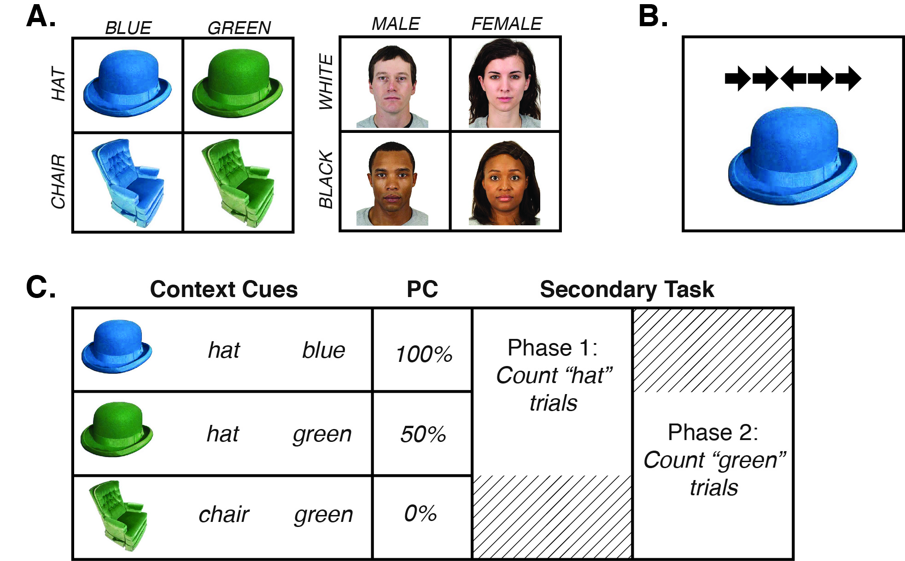

```{r setup, include=FALSE, eval=TRUE,echo=FALSE}
library("dplyr")
library("afex")
library("papaja")
library("magrittr")
library("kableExtra")

#As of 2018/12/07 apa_print() requires development version of Papaja
#devtools::install_github("crsh/papaja")
library(papaja)
```

Selective attention is commonly investigated using interference paradigms such as the Stroop [-@stroop_studies_1935] and flanker [@eriksen_effects_1974] tasks, where participants identify a target while ignoring a response-congruent or -incongruent distractor. Performance is typically better on congruent versus incongruent trials and the difference-the congruency effect-taken as an index of attentional priorities. Large congruency effects are thought to reflect ineffective filtering of the distracting stimuli whereas small congruency effects are thought to reflect effective filtering. By probing factors that systematically alter congruency effects, we can then make inferences about processes that control attentional filtering. For example, manipulating the frequency of conflict via the proportion of congruent versus incongruent trials has shown to influence the size of the congruency effect. Typically, a high proportion congruent experiment produces large congruency effects, whereas a low proportion congruent experiment produces small congruency effects [@logan_when_1979; @lowe_selective_1982; @west_effects_1998]. This result is usually  explained as strategic control, where participants increase attentional control under high-conflict demands and relax attentional control under low-conflict demands [@logan_attention_1980; @logan_strategies_1984; @logan_when_1979; @lowe_selective_1982]. Recent work however, has demonstrated that attentional control is not only adjusted by top-down regulation, but can also be triggered automatically by environmental cues [@brosowsky_memory-guided_2018; @bugg_support_2012; @egner_creatures_2014; @fischer_predicting_2015; @king_priming_2012; @mayr_outsourcing_2007]. 

For example, Crump, Gong, and Milliken [@crump_context-specific_2006; see also, @corballis_independent_2003] presented Stroop stimuli in one of two randomly chosen locations and manipulated the frequency of conflict associated with each location. One location was associated with a high frequency of conflict (25% congruent trials) and the other with a low frequency of conflict (75% congruent trials). Overall, the proportion of congruent trials was 50% and randomized such that the upcoming location could not be predicted. Even so, congruency effects were shown to be smaller for trials where the stimulus appeared in the high conflict location as compared to the low conflict location. This effect, known now as the context-specific proportion congruent effect (CSPC), has now been replicated in a number of different selective attention paradigms [e.g., @alards-tomalin_auditory_2017; @blais_trial-by-trial_2015; @bugg_conflict-triggered_2014; @crump_context-dependent_2018; @crump_learning_2016; @fischer_context-sensitive_2014; @hubner_location-specific_2016].

Critical evidence however, that CSPC effects reflect context-specific control rather than other non-control learning processes [e.g., @schmidt_stroop_2008], comes from work showing that CSPC effects can transfer to frequency unbiased items [@brosowsky_context-specific_2016; @crump_flexibility_2009; @weidler_attentional_2018; @weidler_transfer_2016; though, see @hutcheon_limits_2017]. Crump and Milliken (2009), for example, divided Stroop items into two mutually exclusive sets (e.g., RED/GREEN and BLUE/YELLOW). One set was defined as the frequency biased set, and presented with 75% congruency in one location, and 25% congruency in the other. The second set however, was presented with 50% congruency in both locations. Nevertheless, they found smaller congruency effects for unbiased items presented in the high conflict location as compared to the low conflict location.	

One explanation for CSPC effects is that the repeated application of attentional priorities in a particular context creates an associative link in episodic memory between the attentional control procedures and the contextual information [@abrahamse_grounding_2016; @brosowsky_memory-guided_2018; @crump_learning_2016; @egner_creatures_2014]. Once the associative link is established, processing the context is assumed to trigger the retrieval of previous experiences, automatically reinstating the associated attentional priorities. Although this explanation seems plausible, it remains largely unclear how such associations are established and perhaps more importantly, it remains unclear what determines which learned associations will be used to guide attention at any given moment. 

The importance of the latter issue becomes increasingly clear if we speculate about context-specificity in more complex, real-world environments. Consider myself, right now, writing this article in a coffee shop. The coffee shop is a complex environment that contains a multitude of contextual cues (e.g., pictures on the wall, chairs, coffee, laptop), each of which I have had many different experiences applying attentional control. Although my laptop might cue attentional processing helpful for finishing this article, other features of the coffee shop might cue other, unhelpful attentional processing related to other experiences like socializing and people-watching. This is all to say that our environments, and experiences within them, afford many different associative relationships between cognitive processing and environmental cues. What then determines which associative relationships will be used to guide attention (or even if such associative relationships are used at all)?

Task-relevance might be one factor that is important for establishing and using context-attention associations. This proposal might seem counter-intuitive as it is typically assumed that the context, within selective attention tasks at least, is completely irrelevant to the task. In fact, referring to such stimulus dimensions as the "context" carries with it an implication that the feature is background information, irrelevant to the task-at-hand, and should be ignored by the participant. A closer look at CSPC designs however, suggests that the context cues may not be as irrelevant as implied. For example, the most commonly used context cue is location [@brosowsky_context-specific_2016; @corballis_independent_2003; @crump_context-specific_2006; @crump_context-specific_2008; @crump_learning_2016; @weidler_attentional_2018; @weidler_transfer_2016]. Although in some sense, the location is irrelevant for identifying the color of a word, it seems disingenuous to consider it completely task-irrelevant. In order to identify the target, the participant must first identify and orient to its location on the screen. In this is sense, it is relevant to their ability to complete the task and furthermore, location information may receive priority during encoding [@logan_what_1998; @mayr_spatial_1996]. Similar arguments could be made about other context features that are inherent to processing the target stimulus, like font-type [@bugg_multiple_2008] and color [@vietze_context_2009]. 

To date, we are aware of only one study that has looked at task-relevance within the CSPC literature. Crump, Vaquero, & Milliken [-@crump_context-specific_2008] used a Stroop prime-probe task where the distractor word is presented first followed by a color patch probe. Critically, they used the shape of the color patch probe, either a square or a circle, as the contextual dimension; one associated with a high frequency of conflict, the other with a low frequency. In one experiment participants were made aware of the shape-proportion contingencies but given no additional instructions. In the second, participants were given a secondary task to count the number of trials that contained a square. The first experiment failed to find evidence for context-specificity, whereas the second did. Although not testing task-relevance directly, @canadas_social_2013] found similar effects. In this study they used images of male and female faces as context cues in a flanker task. When given instructions to think of the faces as members of the gender categories they found CSPC effects, but when given instructions to think of the faces as individuals they did not. These results suggest that making a context dimension relevant to the on-going task is important for producing CSPC effects. 

# The Current Study

Prior work suggests that the task-relevance of contextual information is important for establishing new associations between context cues and attentional priorities. Simply put, CSPC effects emerge when context cues are somehow made relevant to the task, but do not when made irrelevant [@canadas_social_2013; @crump_context-specific_2006; @crump_context-specific_2008]. However, it still remains unclear how task-relevance may or may not inform the use of previously learned associations. In the current study, we examined whether manipulating task-relevance would cause participants to ignore a previously learned association and adopt a new context-specific control strategy.

A flanker task was used to measure attentional control in an adapted CSPC design [@crump_flexibility_2009; @crump_reproducing_2017]. Similar to previous studies, flanker stimuli were presented in contexts associated with differing levels of conflict (0%, 50%, or 100% congruent). However, unlike previous CSPC designs where contexts were defined by a single discriminating feature (e.g., upper vs. lower screen locations), contexts were defined by two feature dimensions (see Figure 1A). In one condition, for example, contexts were defined by object identity (hat or chair) and color (blue or green). Only three out of the four possible feature combinations were presented, each associated with a different proportion of congruent trials (0%, 50%, or 100% congruent). Critically, the frequency unbiased context (50% congruent) always shared a feature with each of the frequency-biased contexts (0% and 100% congruent). The frequency biased contexts (0% and 100% congruent) however, did not share any features (see Figure 1C for an example).

A secondary counting task was used to manipulate the task-relevance of the context dimensions [@crump_flexibility_2009] which critically, switched halfway through the experiment. Participants were instructed to keep a running count of one of the overlapping features (e.g., "count whenever a hat is presented") which was associated with either a high or low frequency of conflict. Halfway through the experiment they received new instructions to count the other overlapping feature (e.g., "count whenever a green item is presented"). Critically, the set of context images remained the same throughout the experiment (see Figure 1C for an example) and the task-relevance of the context dimensions was the only aspect of the experiment that changed from the first to second phases.

The critical measure of interest is the congruency effect produced in the frequency unbiased context. If, on the one hand, task-relevance has no impact on the use of context-attention associations we would expect no differences between the congruency effects when the high-conflict context dimension is made task-relevant or the low-conflict context dimension is made task-relevant. This could occur because all three contexts are treated as individual contexts throughout the whole experiment [e.g., @canadas_social_2013]. Or it could occur because associations formed in the first block interfere with learning new associations in the second [e.g., @brosowsky_context-specific_2016]. On other hand, task-relevance might not only dictate how associations are formed, but also whether learned associations are used. In this case, we would expect smaller congruency effects when the high-conflict context dimension is made task-relevant as compared to when the low-conflict context dimension is made task-relevant. This would demonstrate that participants were able to ignore a previously learned association and adopt a new context-specific control strategy.

A secondary goal was to conceptually replicate previous findings and test the generalizability of any task-relevance effects. Therefore, we included three conditions that differed only in the kinds of stimuli used to create context cues. In one condition we used face images where context dimensions were defined by social categories, similar to @canadas_social_2013. However, they found that social categorization occurred spontaneously and it was unclear what impact that would have on the current results. Therefore, we included another condition that used images of simple objects where context dimensions were defined by object features. Finally, @canadas_social_2013 also found that context effects generalized to novel face images. In our third condition we used non-repeating face exemplars to examine whether any task-relevance effects would also generalize in our design or if learning would be image-specific. 

# Methods

(ref:figure1) Illustration of the stimuli and trial construction. Figure 1A shows the feature dimensions for each of the conditions. Figure 1B shows an example trial stimulus containing both the context and flanker images. Figure 1C shows an example of how feature dimensions could have been assigned to each proportion congruency (PC) condition, and an example of the secondary task assignments. The secondary task order, as well as the feature and congruency assignments were all randomized for each participant.

```{r figure1, echo=FALSE, fig.width=6.7,fig.height=4.51, fig.cap='(ref:figure1)'}

```

## Participants

All participants were recruited from Amazon Mechanical Turk (AMT) and compensated $2.00 for participating. The amount compensated was calculated by estimating the maximum amount of time required to complete each experiment and multiplying by $6.00 per hour. For each experiment the number of HITs (Human intelligence tasks, an Amazon term for a work-unit) refers to the number of participants who initiated the study. Participants were included in the study if they completed all trials. We posted 150 HITs and 144 participants completed all trials. 
 
## Apparatus & Stimuli

The experiments were programmed using JavaScript, CSS and HTML. The program allowed participants to complete task only if they were running Safari, Google Chrome, or Firefox web browsers. Flanker stimuli consisted of images of five arrows pointed left or right presented at 250 x 50 pixels (each arrow was 50 x 50 pixels). Context stimuli were constructed using images selected from @brady_visual_2013 color-rotated to blue and green, and face images from the Chicago Face Database [@ma_chicago_2015], supplemented with the NimStim Set of Facial Expressions [@tottenham_nimstim_2009]. The object images were displayed at 250 x 250 pixels, while the face images were displayed at 250 x 313 pixels. The experiment ran as a pop-up window that filled the entire screen. The background was white, and stimuli were presented in the center of the screen.

Design. Experiment 1 used a 2x2x3 mixed design with task-relevant context (0% and 100%) and unbiased-item congruency (congruent and incongruent) as within-subject factors, and context-type (object, social, and social/non-repeating) as the between-subjects factor.
All three conditions were constructed using the same general method. The experiment was divided into two phases. Each phase consisted of 144 flanker trials (48 trials per context), and 13 count response trials for a total of 314 trials. On the count response trials, participants indicated how many trials they had counted until that point. The count response trials occurred once for every 12 flanker trials and was randomly inserted between trial 6 and 12 of each 12-trial block. Each phase ended with one additional count response trial. 

On every flanker trial, participants were presented with flanker stimuli paired with one of three contexts. Each context was associated with a different proportion congruency such that two cues were associated with a biased frequency (0% and 100% proportion congruency), while one was associated with an unbiased frequency (50% proportion congruency). The feature dimensions and corresponding context images assigned to each of the biased and unbiased item sets were randomly determined for each participant. However, context images used for the frequency biased trials never shared features, while the frequency unbiased context image always shared a feature with each of the frequency biased context images (see Figure 1). Additionally, the feature assignments remained the same throughout phases 1 and 2, and critically, the only change to the task was which feature the participant was instructed to count (see Figure 1C for an example).

All critical aspects of the task were randomized between participants. This includes the three chosen context images, the features assigned to proportion levels, the features assigned to each counting condition, the secondary task order, and the order of trials.

## Procedure

All participants were AMT workers who found the experiment using the AMT system. The participant recruitment procedure and tasks were approved by the Brooklyn College Institutional Review Board. Each participant read a short description of the task and gave consent by pressing a button acknowledging they had read the displayed consent form. Participants then completed a short demographic survey, and proceeded to the main task, which was displayed as a pop-up window. Participants were instructed to identify the direction of the center arrow on each trial as quickly and accurately as possible by pressing 'z' if the arrow pointed left, and 'm' if the arrow pointed right. Additionally, they were instructed to silently keep count of the number of trials that contained a feature. In the object context condition, they were asked to count trials that contained a certain color (blue or green) or object-identity (hat or chair) and in the social context conditions they were asked to count the number of trials that contained appeared a certain gender (male or female) or race (black or white). Periodically throughout the experiment, participants were asked to report how many trials they had counted until that point and to restart their count from 0. Halfway through the experiment participants received new instructions about which feature to count (see Figure 1C).
Each trial began with a blank inter-stimulus interval (ISI) of 400 ms, followed by a fixation cross presented in the center of the screen for 200 ms, then a second blank ISI of 400 ms. Next, the flanker and context stimuli appeared in the center of screen (the flanker above the context image; see Figure 1B) and remained on screen until a response was made. Following a response, accuracy feedback was presented for 1000 ms. A response automatically triggered the next trial. 
Halfway through the experiment (157 trials), participants received new instructions about which feature to count and to press the button on-screen when they were ready to continue.


```{r analysis}
source("data-analysis/analysis.R")
```

(ref:figure2) Results from experiment 1 showing congruency effects (incongruent - congruent) for frequency unbiased items in reaction times (left) and error rates (right) as a function of the task-relevant context (100% proportion congruent versus 0% proportion congruent).

```{r figure2, echo=FALSE,fig.width=6.875, fig.height= 4, fig.cap='(ref:figure2)'}
figure2
```

# Results 

Participants with mean error rates greater than 25% were excluded from the analyses, eliminating `r N_subjects_removed` participants. For all remaining participants, the correct RTs from frequency unbiased trials in each condition were submitted to an outlier removal procedure. The non-recursive Van Selst and Jolicoeur outlier removal procedure was applied after removing response times greater than 3000 ms [@van_selst_solution_1994]. This procedure removed `r round(percent_removed*100,digits = 2)`% of the total observations.

The primary question of interest was whether the task-relevance of context features associated with different levels of conflict would influence the size of the congruency effect for frequency unbiased items (see Table 1). To that end, mean correct RTs and mean error rates from frequency unbiased trials were submitted to a mixed analysis of variance (ANOVA) with task-relevant context (0% and 100% PC) and unbiased-item congruency (congruent and incongruent) as within-subject factors, and context-type (object, social, and social/non-repeating) as the between-subjects factor.

The results of the RT analysis revealed the critical, two-way interaction between task-relevant context and unbiased-item congruency to be significant, `r RT_ANOVA$Task_Relevant_Context_Congruency`, demonstrating smaller congruency effects when the context dimension associated with high conflict was made task-relevant. Additionally, the three-way interaction between the task-relevant context, unbiased-item congruency, and context-type was non-significant, `r RT_ANOVA$Condition_Task_Relevant_Context_Congruency`, showing no evidence for differences between the CSPC effects across context-type manipulations.

Similarly, the corresponding error analysis also resulted in a significant two-way interaction between the task-relevant context and unbiased-item congruency, `r ACC_ANOVA$Task_Relevant_Context_Congruency`, and a non-significant three-way interaction between task-relevant context, unbiased-item congruency, and context-type, `r ACC_ANOVA$Condition_Task_Relevant_Context_Congruency`. Therefore, the congruency effects in error rates were also smaller when the context dimension associated with high conflict was made task-relevant, corroborating the results of the reaction time analysis.

\begingroup
\setlength{\parindent}{0in}
\vspace{2.5mm}
\textbf{Table 1. \\ \textit{Reaction times and error rates from Experiment 1.}}

 
\endgroup


# General Discussion
	
The aim of the current study was to determine whether task-relevance plays a role in the contextual recruitment of selective attention. Specifically, we tested whether manipulating the relative task-relevance of context cues could cause participants to ignore a previously learned context-association and apply a new association. We created a frequency unbiased context cue that shared features with two frequency biased contexts and used a feature-counting task to manipulate the task-relevance of context dimensions across two blocks of trials. Critically, halfway through the experiment participants received new instructions changing the task-relevant feature from one frequency biased cue to the other. 

The key finding was that the congruency effects for the frequency unbiased items were significantly larger when the low-conflict context was made task-relevant as compared to when the high-conflict context was made task-relevant. This result is consistent with prior CSPC effects and, like the previous work, suggests that the context cues triggered rapid adjustments to attentional control [@crump_flexibility_2009]. However, unlike prior studies, we were able to experimentally manipulate the CSPC effect across blocks of trials without changing any of the physical properties of the stimuli. This novel finding demonstrates that participants were able to learn and apply one context-attention association in the first phase, and subsequently ignore that association to learn a new association in the second phase. 

This result implicates an important role for task-relevance in producing CSPC phenomena. @crump_context-specific_2008 used shapes as context cues in a prime-probe Stroop task and did not find CSPC effects until the context cues were made task-relevant. Similarly, @canadas_social_2013 eliminated the CSPC effect by making the contextual cue effectively unrelated to the task. These studies suggest that task-relevance plays an important role in establishing associations between contextual information and attentional priorities to produce CSPC effects. Our finding extends this work in two important ways. First, we show that changing the task-relevance of the presented cues corresponded with a change in attentional control in the predicted direction. This demonstrates that task-relevance is also a key determinant of whether a previously learned attention-context association will be used or ignored in favor of a new association. Second, we show that task-relevance allowed participants resolve competition between two competing contextual cues, responding on the basis of one at the expense of the other. To our knowledge, this is the first demonstration that CSPC effects can be produced when there are multiple, overlapping contextual cues available. 

In light of prior work, we take this as evidence that the contextual recruitment of selective attention, although likely implicit, is not obligatory [e.g., @brosowsky_context-specific_2016], requiring that environmental information be incorporated into the task representation. Similarly, there appears to be flexibility in which environmental features are selected and used to guide attention, which can be rapidly updated depending on the task-relevance of those features. Such a result lends some insight into how context-specific control might operate in more complex, real-world environments, where there is an over-abundance of environmental features that afford many different learned associations. From a theoretical perspective, this result is consistent memory-based accounts of CSPC phenomena [@brosowsky_memory-guided_2018; @bugg_converging_2013; @crump_context-dependent_2018; @crump_flexibility_2009; @crump_reproducing_2017]. Under this view, a memory process encodes attentional priorities in the representation of individual experiences and, as a result, become associated with the environment where they were used. The subsequent reoccurrence of a prior context triggers the retrieval and reinstatement of those attentional priorities. Our results show however, that all the features of the environment may not be treated equally and that only task-relevant features are used to probe memory and guide attention. 

Another key result of this study concerned the different stimuli used as context cues. Across the three conditions, we varied the type of context image and dimensions. We manipulated the type of image presented, including both objects (identity and color dimensions) and faces (gender and racial dimensions). We also manipulated whether a single set of three repeating images were presented (object and social) or a set of non-repeating images were presented (social/non-repeating). Across all three conditions, we found no evidence that using different stimuli had an influence on the size or direction of the CSPC demonstrating generalizability of this phenomenon. Furthermore, CSPC effects were present even when using non-repeating images which suggests that context-dependency did rely on image-specific associations but higher-order, learned categorical information. 

Traditional models of person perception posit that social categories are automatically activated in the presence of social stimuli  [e.g., @brewer_dual_1988; @devine_stereotypes_1989; @fiske_continuum_1990]. @canadas_social_2013 however, found that directing participants to think about faces in terms of individual features eliminated context-specific attention effect and suggested that momentary motivations may influence the automaticity of social categorization. Our results add to this literature by observing the influence of momentary motivations (i.e., task-relevance) when there is competition between two salient social categories. Specifically, we found that participants could categorize on the basis of one social cue at the expense of the other, and subsequently switch between them. These findings may speak to issues of automaticity in social categorization [@macrae_social_2001] as well as understanding how the situational context can prime one social identity over another [@crisp_multiple_2007]. Furthermore, we found no evidence for differences between the social and object conditions. This suggests that categorization within the CSPC task is quickly and easily learned when the task supports such learning and is non-unique to social stimuli. 

In sum, our results provide new evidence that changes in task-relevance can update the contextual recruitment of selective attention in a CSPC flanker task. We demonstrated that making one context cue task-relevant produced a CSPC effect, even in the presence of a competing contextual cue. More important however, we found that changing the task-relevance of the contextual cues across blocks of trials was accompanied by predictable changes in the congruency effects. These effects were found to be generalizable across two different kinds of stimuli and occurred even when using non-repeating images, and implicate an important role for task-relevance in producing context-dependency and are consistent with memory-based accounts of CSPC phenomena.
 


\newpage

# References

\begingroup
\setlength{\parindent}{-0.5in}
\setlength{\leftskip}{0.5in}

<div id = "refs"></div>
\endgroup


\newpage


```{r tableLatex}
#if (knitr::opts_knit$get("rmarkdown.pandoc.to")== "latex"){
#source("data-analysis/table1.R")
#latexTable1
#}
```


